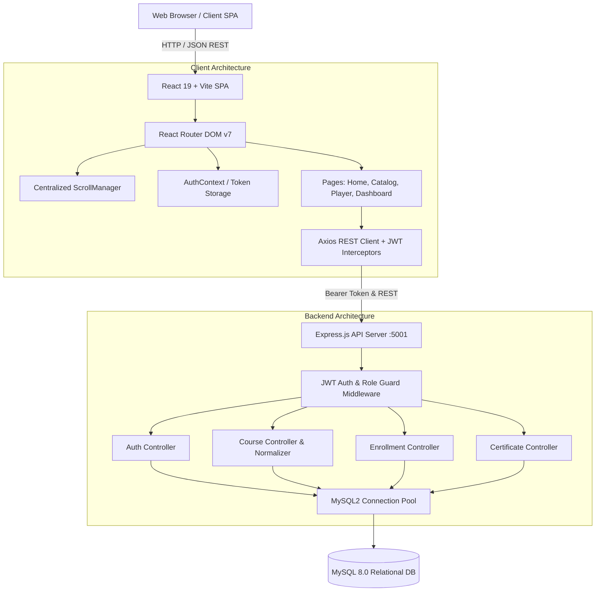

# Eduvia LMS — Production-Grade Learning Management System 🎓⚡


[](https://react.dev/)
[](https://vitejs.dev/)
[](https://tailwindcss.com/)
[](https://nodejs.org/)
[](https://expressjs.com/)
[](https://www.mysql.com/)
[](https://jwt.io/)
[](LICENSE)

**Eduvia LMS** is a modern, production-grade **Learning Management System & EdTech Platform** built with **React 19**, **Node.js/Express**, **MySQL**, and **Tailwind CSS v4**. Engineered with an emphasis on engineering excellence, Eduvia features verified digital credentialing, dual independent syllabus player navigation, real-time catalog search with canonical category normalization, role-based access for students and educators, and centralized Reddit-like scroll restoration across client-side routes.

---

## 🏛️ System Architecture



---

## 🌟 Features & Core Capabilities

### 1. 🎓 Comprehensive Curriculum & Catalog (24 Masterclasses)
- **Balanced Across 5 High-Demand Engineering Disciplines**:
  - **Web Development**: React 19, Next.js Full-Stack, Spring Boot 3 Microservices, Node.js Distributed Backends, TypeScript Production Architecture.
  - **AI & Machine Learning**: Python & Scikit-Learn, Deep Learning with PyTorch, Generative AI & Production LLMs, Prompt Engineering, NLP with Transformers.
  - **Cloud & DevOps**: AWS Solutions Architecture, Docker & Kubernetes Orchestration, GitHub Actions CI/CD Pipelines, Terraform Infrastructure as Code (IaC), Cloud-Native Resilience.
  - **UI/UX Design**: Enterprise Design Systems, Advanced Figma Workflows, UX Research & Usability Prototyping, Accessibility-First (WCAG) Design.
  - **Systems & Programming**: Java 21 High-Throughput Engineering, FAANG Data Structures & Algorithms, OS & Kernel Systems in C/C++, High-Concurrency Go, Distributed Systems & Consensus Protocols.
- **Canonical Category Normalization**: Centralized alias resolver supporting all search permutations (`'AI & Machine Learning'`, `'AI & ML'`, `'aiml'`) ensuring zero empty-state query failures.

### 2. 🎬 Dual Independent Course Player
- **Reddit-Style Independent Scrolling**: Desktop syllabus navigation sidebar maintains its own scroll context while the video player and contextual lecture tabs scroll independently.
- **Interactive Checkpoint Tracking**: Dynamic completion toggles with optimistic state synchronization and local storage persistence.
- **Integrated Unit Quizzes**: In-player multi-choice assessments evaluating milestone knowledge retention before certificate issuance.

### 3. 📊 Personalized Learning Hub & User State Integrity
- **Dynamic Student Dashboard**: Authentic welcome messaging, active course continuation cards, and 7-day study streak visualizers.
- **Clean User State Separation**:
  - **Seeded Demo Accounts**: Rich pre-seeded metrics (68% completion, 12-day streak, 24.5 study hours, verified credentials).
  - **New Student Registrations**: Clean, zero-state onboarding ("Day 1 • Ready to learn", 0 enrolled courses, empty certificates).

### 4. 📜 Cryptographically Verified Certificates
- Automated certificate generation with unique verification hashes (`EDV-CRED-XXXX`).
- Comprehensive metadata recording student name, completion date, course track, and accredited instructor signatory.

### 5. 👨‍🏫 Instructor Studio & Course Management
- Dedicated educator workspace for monitoring authored masterclasses, aggregate student enrollment metrics, and gross tuition revenue.
- Course creation modal with automatic educator profile linking.

### 6. 🎨 Production Visual System & Restrained Glassmorphism
- **60 / 30 / 10 Visual Hierarchy**: Alternating section rhythm utilizing Deep Navy (`#0F172A`), Warm Ivory (`#FAF9F5`), Cool Surface (`#F1F5F9`), and Brand Blue (`#2563EB`).
- **Secondary Glassmorphism Tokens**: Frosted micro-cards (`.eduvia-glass`, `.eduvia-glass-card`) layered over warm surfaces without compromising legibility.
- **Wide Screen Utilization**: Full-width connected navigation bar (`max-w-[1680px]`) and expansive `max-w-[1440px]` desktop content containers.
- **Centralized SPA Scroll Restoration**: Forward route navigations reset to top `(0, 0)`, in-page filter pill clicks preserve current scroll, and browser Back/Forward restores previous offsets.

---

## 🛠️ Technology Stack

| Layer | Technologies |
| :--- | :--- |
| **Frontend Core** | React 19.0, Vite 6.0, JavaScript (ES6+), React Router DOM v7 |
| **Styling & UI** | Tailwind CSS v4.0, CSS Variables, Lucide React Icons, Custom Glass Tokens |
| **State & Networking** | Context API (AuthContext), Axios HTTP Client with Bearer Interceptors |
| **Backend Core** | Node.js (v20+), Express.js 4.21, REST Architecture |
| **Security & Auth** | JSON Web Tokens (JWT), BcryptJS Password Hashing, Role Guards |
| **Database** | MySQL 8.0 (Relational schema with Foreign Keys, Cascades & Pool fallback) |

---

## 📁 Repository Structure

```
Eduvia/
├── client/
│   ├── public/
│   ├── src/
│   │   ├── components/            # Reusable UI components (Navbar, Footer, CourseCard, QuizModal, etc.)
│   │   │   └── ui/                # Atomic primitives (Button, Badge, ProgressBar, StatCard, EmptyState)
│   │   ├── context/               # Global state providers (AuthContext.jsx)
│   │   ├── data/                  # coursesData.js (24 Masterclasses Catalog & normalizeCategory)
│   │   ├── layouts/               # MainLayout.jsx (Header, Viewport Main, Footer)
│   │   ├── pages/                 # Home, Courses, CourseDetails, CoursePlayer, StudentDashboard, etc.
│   │   ├── services/              # api.js (Axios), enrollmentService.js (User Learning State)
│   │   ├── utils/                 # scrollManager.jsx (Centralized SPA Scroll Restoration)
│   │   ├── App.jsx                # Router declaration & ScrollManager mount
│   │   ├── index.css              # Design tokens, Glassmorphism, Theme typography
│   │   └── main.jsx               # Application entry point
│   ├── package.json
│   └── vite.config.js
├── server/
│   ├── config/                    # db.js (MySQL2 Connection Pool)
│   ├── controllers/               # authController, courseController, enrollmentController, certificateController
│   ├── middleware/                # authMiddleware.js (JWT Bearer Verification & Role Guards)
│   ├── routes/                    # Express API route declarations
│   ├── server.js                  # API Server entry point & health check
│   ├── package.json
│   └── .env.example               # Backend environment template
├── schema.sql                     # Production MySQL relational database schema & seed scripts
├── .env.example                   # Root environment configuration template
├── .gitignore                     # Git hygiene & secret exclusion rules
└── README.md
```

---

## 🚀 Getting Started

Follow these instructions to set up and run Eduvia LMS locally.

### Prerequisites
- **Node.js**: v18.0 or higher ([Download](https://nodejs.org/))
- **npm**: v9.0 or higher
- **MySQL**: v8.0 or higher (Optional — server automatically falls back to in-memory store if MySQL is offline)

---

### 1. Clone the Repository

```bash
git clone https://github.com/RajMehra01/Eduvia.git
cd Eduvia
```

---

### 2. Configure Environment Variables

Create `.env` in the `server` directory using the provided template:

```bash
cp .env.example server/.env
```

Review `server/.env` and update the database credentials for your local environment:

```env
PORT=5001
DB_HOST=localhost
DB_USER=your_mysql_username
DB_PASSWORD=your_mysql_password
DB_NAME=eduvia_lms_db
JWT_SECRET=your_jwt_secret_key_here
```

---

### 3. Database Initialization (Optional)

If running a local MySQL server:

```bash
mysql -u root -p < schema.sql
```

*(If MySQL is not installed, the server will seamlessly use its built-in in-memory mock store for demo testing).*

---

### 4. Start the Backend API Server

```bash
cd server
npm install
npm start
```

Backend will start on: **`http://localhost:5001`**

---

### 5. Start the Frontend Application

In a separate terminal window:

```bash
cd client
npm install
npm run dev
```

Frontend application will launch at: **`http://localhost:5174`**

---

## 🌐 Development URLs

| Service | URL | Description |
| :--- | :--- | :--- |
| **Frontend Application** | `http://localhost:5174` | Eduvia Student & Instructor Web App |
| **Backend REST API** | `http://localhost:5001/api` | API Base Endpoint |
| **API Health Check** | `http://localhost:5001/api/health` | Service status & timestamp |
| **Course Catalog API** | `http://localhost:5001/api/courses` | 24 Masterclasses with query filtering |

---

## 🔑 Development Demo Accounts

These accounts are seeded for rapid local testing:

| Role | Email | Password | Access Portal |
| :--- | :--- | :--- | :--- |
| **Student** (Seeded) | `alex.morgan@eduvia.org` | *Any password in demo mode* | Student Hub (`/student-dashboard`) |
| **Instructor** (Seeded) | `elena@eduvia.org` | *Any password in demo mode* | Instructor Studio (`/instructor-dashboard`) |
| **New Learner** | *Register any new email* | *Your choice* | Fresh zero-state learner experience |

---

## 🔒 Security & Environment Protection

- **No Secrets in Version Control**: `.env` and local configuration files are strictly excluded via `.gitignore`.
- **Stateless Authentication**: Protected API endpoints enforce cryptographically signed JSON Web Tokens (JWT) transmitted via HTTP Authorization Bearer headers.
- **Environment Templates**: Only placeholder values are committed in `.env.example`.

---

## 🧪 Build & Verification

The project compiles cleanly and meets all production build standards:

```bash
# Frontend production build
cd client
npm run build
```
- **Vite Production Bundler**: 1,669 modules transformed, 0 errors, gzip optimized.

---

## 📄 License

This project is licensed under the **MIT License**. See the [LICENSE](LICENSE) file for details.

---

## 👤 Author

Developed by **Raj Mehra**

- **Intern ID**: `CITS4953`
- **GitHub**: [https://github.com/RajMehra01](https://github.com/RajMehra01)
